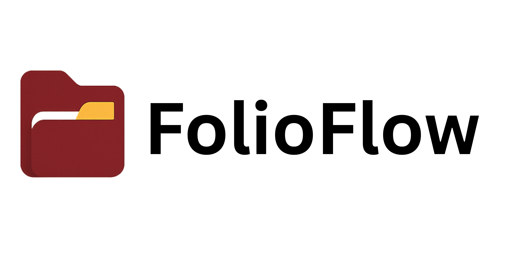
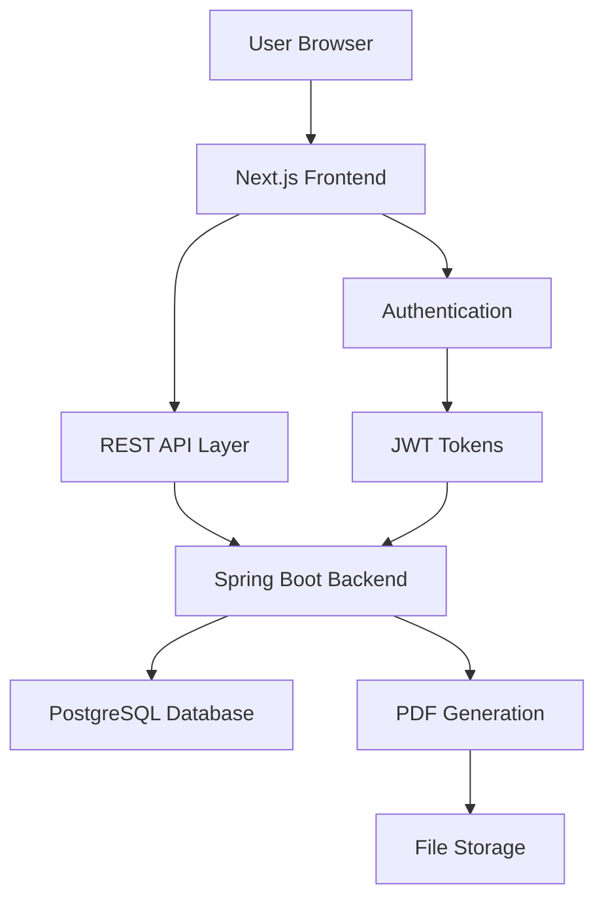

# FolioFlow

> A modern, full-stack web application for creating professional PDF portfolios with ease

<div align="center">
  
</div>

<div align="center">

[](https://nextjs.org/)
[](https://spring.io/)
[](https://typescriptlang.org/)
[](https://postgresql.org/)
[](https://tailwindcss.com/)

</div>

## Overview

**FolioFlow** is a sophisticated web-based application that revolutionizes the way professionals create and manage their portfolios. Built with modern technologies, it provides a streamlined, step-by-step process to help users craft visually appealing PDF portfolios that showcase their skills, experience, and projects effectively.

### ✨ Key Features

- **🔐 Secure Authentication**: Sign up/sign in with email or Google OAuth2
- **📝 Guided Portfolio Creation**: Step-by-step form-based portfolio building
- **💾 Data Persistence**: Save and manage multiple portfolio drafts
- **📱 Responsive Design**: Mobile-first, responsive UI built with Tailwind CSS
- **🎨 Modern Interface**: Clean, professional UI using Shadcn/UI components
- **📄 PDF Generation**: Export portfolios as professionally formatted PDF documents
- **⚡ Real-time Updates**: Instant saving and loading of portfolio data
- **🌙 Theme Support**: Light/dark mode toggle for user preference

## Technology Stack

### Frontend
- **Framework**: [Next.js 15](https://nextjs.org/) (App Router)
- **Language**: TypeScript
- **Styling**: [Tailwind CSS](https://tailwindcss.com/)
- **Components**: [Shadcn/UI](https://ui.shadcn.com/) + [Radix UI](https://www.radix-ui.com/)
- **Forms**: React Hook Form with Zod validation
- **State Management**: React Hooks + Client-side caching
- **Icons**: Lucide React
- **Notifications**: Sonner
- **Authentication**: JWT + HTTP-only cookies

### Backend
- **Framework**: [Spring Boot 3.4.5](https://spring.io/projects/spring-boot)
- **Language**: Java 17
- **Database**: PostgreSQL
- **ORM**: Spring Data JPA with Hibernate
- **Security**: Spring Security 6 + JWT
- **OAuth2**: Google OAuth2 integration
- **PDF Generation**: Flying Saucer + OpenPDF
- **API Documentation**: OpenAPI 3 (Swagger)
- **Build Tool**: Maven

### DevOps & Tools
- **Database**: PostgreSQL
- **API Testing**: OpenAPI/Swagger UI
- **Code Quality**: ESLint, TypeScript strict mode
- **Package Management**: npm (frontend), Maven (backend)

## Architecture

FolioFlow follows a modern full-stack architecture with clear separation of concerns:

### System Overview



### Technology Stack Architecture

| Layer | Technology | Purpose | Key Features |
|-------|------------|---------|--------------|
| **Frontend** | Next.js 15 + TypeScript | User Interface | • Server/Client Components<br>• App Router<br>• Static Site Generation |
| **Styling** | Tailwind CSS + Shadcn/UI | Design System | • Responsive Design<br>• Component Library<br>• Theme Support |
| **State** | React Hooks + Forms | State Management | • Form Validation<br>• Real-time Updates<br>• Client Caching |
| **Backend** | Spring Boot 3.4.5 | Business Logic | • RESTful APIs<br>• Security Layer<br>• Data Processing |
| **Security** | Spring Security + JWT | Authentication | • OAuth2 Integration<br>• Token Management<br>• Role-based Access |
| **Database** | PostgreSQL + JPA | Data Persistence | • ACID Compliance<br>• JSON Storage<br>• Relationships |
| **PDF Engine** | Flying Saucer + OpenPDF | Document Generation | • HTML to PDF<br>• Template Engine<br>• Custom Styling |

### Component Architecture

#### Frontend Components
```
frontend-web/
├── 📁 app/                    # Next.js App Router
│   ├── 🏠 page.tsx           # Landing page
│   ├── 🔐 auth/              # Authentication pages
│   ├── 📊 dashboard/         # User dashboard
│   ├── 📄 portfolios/        # Portfolio management
│   └── 👤 profile/           # User profile
├── 📁 components/            # Reusable UI components
│   ├── 🎨 ui/                # Shadcn/UI components
│   └── 🧩 custom/            # Custom components
└── 📁 lib/                   # Utilities & configurations
```

#### Backend Structure
```
backend/website/
├── 📁 controllers/           # REST API endpoints
│   ├── AuthController        # Authentication APIs
│   ├── PortfolioController   # Portfolio CRUD APIs
│   └── PdfController         # PDF generation APIs
├── 📁 entities/              # JPA entities
│   ├── UserEntity           # User data model
│   ├── PortfolioEntity      # Portfolio data model
│   └── RefreshToken         # Token management
├── 📁 services/              # Business logic
├── 📁 repositories/          # Data access layer
├── 📁 security/              # Security configurations
└── 📁 utilities/             # Helper classes
```

### Data Flow Architecture

| Step | Component | Action | Data Format |
|------|-----------|--------|-------------|
| 1 | **User Interface** | User interaction | Form Input |
| 2 | **React Forms** | Validation & submission | JSON |
| 3 | **API Layer** | HTTP request to backend | REST/JSON |
| 4 | **Spring Controller** | Route to service | Java Objects |
| 5 | **Service Layer** | Business logic processing | DTOs |
| 6 | **Repository Layer** | Database operations | JPA Entities |
| 7 | **PostgreSQL** | Data persistence | Relational Data |
| 8 | **PDF Generator** | Document creation | Binary PDF |

### Security Architecture

| Layer | Implementation | Features |
|-------|----------------|----------|
| **Frontend Security** | • HTTP-only cookies<br>• CSRF protection<br>• Input validation | • Secure token storage<br>• XSS prevention<br>• Client-side validation |
| **API Security** | • JWT authentication<br>• CORS configuration<br>• Rate limiting | • Stateless authentication<br>• Cross-origin control<br>• Request throttling |
| **Backend Security** | • Spring Security<br>• OAuth2 integration<br>• Password hashing | • Role-based access<br>• Social login<br>• BCrypt encryption |
| **Database Security** | • Connection pooling<br>• SQL injection prevention<br>• Data encryption | • Prepared statements<br>• Parameterized queries<br>• Encrypted storage |

### Performance Architecture

| Optimization | Technology | Impact |
|--------------|------------|---------|
| **Frontend** | • Next.js SSR/SSG<br>• Image optimization<br>• Code splitting | • Faster initial load<br>• Optimized assets<br>• Reduced bundle size |
| **Caching** | • Browser caching<br>• API response caching<br>• Static asset CDN | • Reduced server load<br>• Faster responses<br>• Global distribution |
| **Backend** | • Connection pooling<br>• Lazy loading<br>• Query optimization | • Efficient DB connections<br>• On-demand data loading<br>• Faster queries |
| **Database** | • Indexed columns<br>• Query optimization<br>• Connection pooling | • Fast lookups<br>• Efficient joins<br>• Resource management |

## Core Features Deep Dive

### 1. User Management
- **Account Creation**: Email/password registration with validation
- **Google OAuth2**: One-click sign-in with Google accounts
- **JWT Authentication**: Secure token-based authentication
- **Session Management**: Automatic token refresh and secure logout

### 2. Portfolio Management
- **Create Multiple Portfolios**: Users can maintain several portfolio drafts
- **Structured Data Input**: Organized sections for:
  - Personal Information (name, contact, bio)
  - Employment History (positions, companies, descriptions)
  - Educational Background (degrees, institutions, achievements)
  - Skills (technical and soft skills with proficiency levels)
  - Project Showcases (descriptions, technologies, links)

### 3. PDF Generation
- **Professional Templates**: Custom-designed PDF layouts
- **Dynamic Content**: Real-time rendering of user data
- **Download Ready**: High-quality PDF output optimized for printing

### 4. User Interface
- **Responsive Design**: Works seamlessly on desktop, tablet, and mobile
- **Accessibility**: WCAG compliant with keyboard navigation support
- **Modern UX**: Intuitive navigation with progress indicators
- **Real-time Feedback**: Instant validation and error handling

## Getting Started

### Prerequisites
- Node.js 18+ and npm
- Java 17+
- Maven 3.6+
- PostgreSQL 12+

### Frontend Setup

1. **Clone the repository**
   ```bash
   git clone <repository-url>
   cd project/frontend-web
   ```

2. **Install dependencies**
   ```bash
   npm install
   ```

3. **Set up environment variables**
   ```bash
   # Create .env.local file
   NEXT_PUBLIC_API_BASE_URL=http://localhost:8080
   NEXT_PUBLIC_APP_URL=http://localhost:3000
   ```

4. **Start development server**
   ```bash
   npm run dev
   ```

   Frontend will be available at `http://localhost:3000`

### Backend Setup

1. **Navigate to backend directory**
   ```bash
   cd project/backend/website
   ```

2. **Configure database**
   ```bash
   # Create PostgreSQL database
   createdb folioflow_db
   
   # Update application.properties with your database credentials
   ```

3. **Set up environment variables**
   Create environment variables for your sensitive configuration:
   
   **Option 1: Environment Variables (Recommended for Production)**
   ```bash
   # Database Configuration
   export DATABASE_URL="jdbc:postgresql://localhost:5432/folioflow_db"
   export DATABASE_USERNAME="your_postgres_username"
   export DATABASE_PASSWORD="your_postgres_password"
   
   # JWT Configuration (Generate a secure secret)
   export JWT_SECRET="your-super-secret-jwt-key-here-at-least-256-bits-long"
   export JWT_EXPIRATION="86400000"
   export JWT_REFRESH_EXPIRATION="604800000"
   
   # Google OAuth2 Configuration
   export GOOGLE_CLIENT_ID="your-google-oauth2-client-id"
   export GOOGLE_CLIENT_SECRET="your-google-oauth2-client-secret"
   
   # OAuth2 Redirect URI
   export OAUTH2_REDIRECT_URI="http://localhost:3000/oauth2/redirect"
   ```
   
   **Option 2: Create `.env` file (For Local Development)**
   ```bash
   # Create .env file in backend/website/ directory
   cd backend/website
   touch .env
   ```
   
   Then add your variables to the `.env` file:
   ```properties
   DATABASE_URL=jdbc:postgresql://localhost:5432/folioflow_db
   DATABASE_USERNAME=your_postgres_username
   DATABASE_PASSWORD=your_postgres_password
   JWT_SECRET=your-super-secret-jwt-key-here-at-least-256-bits-long
   JWT_EXPIRATION=86400000
   JWT_REFRESH_EXPIRATION=604800000
   GOOGLE_CLIENT_ID=your-google-oauth2-client-id
   GOOGLE_CLIENT_SECRET=your-google-oauth2-client-secret
   OAUTH2_REDIRECT_URI=http://localhost:3000/oauth2/redirect
   ```

4. **Build and run**
   ```bash
   mvn clean install
   mvn spring-boot:run
   ```

   Backend API will be available at `http://localhost:8080`

### Database Schema

The application uses the following main entities:

- **Users**: Store user account information and authentication data
- **Portfolios**: Store portfolio metadata and JSON content
- **Refresh Tokens**: Manage JWT refresh token lifecycle
- **Generated PDFs**: Track PDF generation history

## Application Flow

1. **Landing Page**: Users discover FolioFlow features and benefits
2. **Authentication**: Sign up/sign in via email or Google OAuth2
3. **Dashboard**: Overview of existing portfolios with creation options
4. **Portfolio Creation**: Step-by-step guided process through forms
5. **Portfolio Editing**: Modify and update existing portfolio content
6. **PDF Generation**: Export completed portfolios as PDF documents
7. **Portfolio Management**: View, edit, duplicate, or delete portfolios

## API Endpoints

### Authentication
- `POST /api/auth/signup` - Register new user
- `POST /api/auth/signin` - User login
- `POST /api/auth/logout` - User logout
- `POST /api/auth/refresh` - Refresh JWT token

### Portfolio Management
- `GET /api/users/{userId}/portfolios` - Get user portfolios
- `POST /api/users/{userId}/portfolios` - Create new portfolio
- `GET /api/portfolios/{portfolioId}` - Get portfolio details
- `PUT /api/portfolios/{portfolioId}` - Update portfolio
- `DELETE /api/portfolios/{portfolioId}` - Delete portfolio

### PDF Management
- `POST /api/portfolios/{portfolioId}/generate-pdf` - Generate portfolio PDF
- `GET /api/portfolios/{portfolioId}/download-pdf/{filename}` - Download generated PDF
- `GET /api/users/{userId}/generated-pdfs` - List all generated PDFs for user
- `DELETE /api/portfolios/{portfolioId}/generated-pdfs/{filename}` - Delete specific PDF

### API Documentation
- [`GET /swagger-ui/index.html`](http://localhost:8080/swagger-ui/index.html#/Portfolio%20Management) - Interactive API documentation

> **Note**: If PDF endpoints don't appear in Swagger UI, ensure the `PdfController` is properly component-scanned and the application is restarted.

## Future Enhancements

- **Template Selection**: Multiple PDF template options
- **Cloud Storage**: Integration with cloud storage providers
- **Portfolio Sharing**: Public portfolio URLs
- **Analytics**: Portfolio view tracking and insights
- **Export Options**: Additional export formats (Word, HTML)
- **Collaboration**: Team portfolio creation features
- **AI Integration**: AI-powered content suggestions

## Contributing

We welcome contributions! Please feel free to submit a Pull Request. For major changes, please open an issue first to discuss what you would like to change.

1. Fork the repository
2. Create your feature branch (`git checkout -b feature/AmazingFeature`)
3. Commit your changes (`git commit -m 'Add some AmazingFeature'`)
4. Push to the branch (`git push origin feature/AmazingFeature`)
5. Open a Pull Request

## License

This project is licensed under the MIT License - see the [LICENSE](LICENSE) file for details.

## Author

**Andri Apas**
- GitHub: [@drewqt11](https://github.com/drewqt11?tab=repositories)
- Email: andriapas4@gmail.com

## Acknowledgments

- [Shadcn/UI](https://ui.shadcn.com/) for the amazing component library
- [Lucide](https://lucide.dev/) for the beautiful icons
- [Tailwind CSS](https://tailwindcss.com/) for the utility-first CSS framework
- [Spring Boot](https://spring.io/projects/spring-boot) for the robust backend framework
- [Next.js](https://nextjs.org/) for the powerful React framework

---